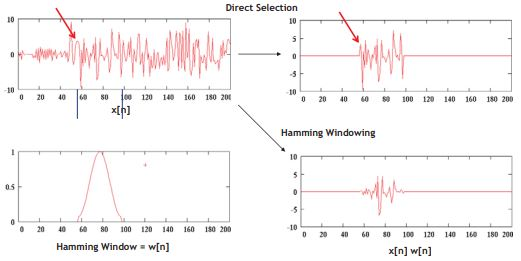
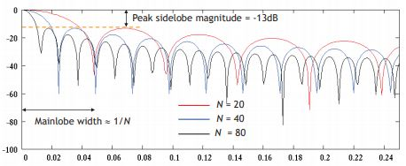
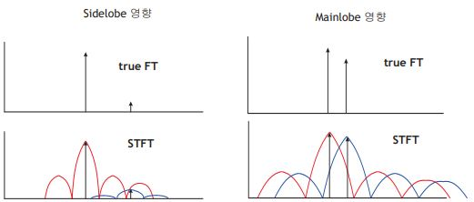
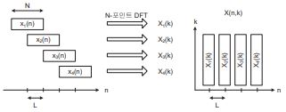

# DSP review

You can intuitively get an idea of what fourier transform is.

</img>

## Fourier Transform
Fourier transform changes a view for signals. We are familier with seeing x-axis as continuous time. The normal graph changes by fourier transform to have x-axis as frequency. These concept is applied to not only continuous time domain, but also to discrete time domain and just discrete slots. These are named to `CTFT (Continuous-Time Fourier Transform)`, `DTFT (Discrete-Time Fourier Transform)`, `DFT (Discrete Fourier Transform)`. More details about systems equation analysis are in Signal ans System lectures. 
  

## CTFT and DTFT
In signals and system, you've learned about correlation as follows:  

</img>

Basis signal of continuous time signal with fundamental frequency f0 is as follows:

</img>

As fourier transform is represented to correlation between x(t) and basis signal, transformed X(f) and verse x(t) are as follows:

</img>

</img>

These are quite easily able to understand when you apply the x(t) to frequency domain. It would be explained that "If you want to get a signal at very right t0 time, you need to sum all the frequencies over f-domain and coefficient of them individually". This interperetation is applied to X(f) in exactly same way.  
Then what is DTFT? See a figure below.  
  
Sampling is multiplication with signals and impulse train with sampling period T. And multiplication on time domain is transformed to convolution on frequency domain. This concepts are explained following figure.  
  
There are helpful notes to make you understand more clearly in the `pdf folder`.

## DFT Notes (N-Point)
Following pages are personal notes. If you find something wrong, please make an issue in github. Conclusion of DFT is that it has to take N positive integer point which is resolution of frequency. Then selected points get a convolution with basic signal represented with N and k. In the pdf, `k` means resolution of frequency. For example, if our sampling frequency is 8,000Hz and we take 100 point DFT, this frequency resolution of DFT is going to be 80Hz.  
  

</img>

</img>

</img>

</img>

</img>

</img>

</img>

## Short-Time Fourier Transform
Fourier transform is infinitive integration. Obviously, spectral magintude show just average of total signal frequency response. Only phase provides time varying characteristic. But audio or speech signal have information per unit time or regular time, not over all signal. This is why we need segmented specturm for comparing it with previous or next spectrum one by one.  
But If we cut some interval in signal off, it raise rapid change edge of boundary, called boundary effet. This effect cause spectrum distortion. To prevent this situation, we usually use window function to that interval. Example is as following.  
   
There are many kind of windows (rectangular, hamming, hanning, blackman, sine, cosine). Spectrum of windows depends on kind of window. Following figure shows terms about window spectrum. Sidelobe means difference between peak to next peak in dB scale. Mainlobe is certain first baulked point.  
  
You can infer from above figure that strong sidelobe and mainlobe would make distortion in some case as follows.  
  
Finally, signal segment segmented with regular interval, which is window length, is covered by window and transformed. And this process is repeated moving next segment as far as stride with overlap. This overlap make distortion or loss of information by boundary effect down.

## Spectrogram
We've made short time fourier transform spectrums. Final process to make an spectrogram is gather all the spectrums along with horizontal axis. In this time, vertical axis is represented to magnitude of spectrums. you can easily infer that spectrogram has 3-dimensional tensors. Including spectrogram, there are a lot of feature of audio signal like mel-spectrogram, log-spectrogram, MFCC, etc. These features are going to be treated in other repo.  

## Reference
- https://web.stanford.edu/class/ee179/lectures/notes11.pdf
- https://lmb.informatik.uni-freiburg.de/lectures/old_lmb/bildverarbeitung/Exercise07/GibbsPhenomena.pdf
- [Audio Signal Feature Extraction Process for Automatic Speech Recognition based on Deep Nueral Network (2020, Kwangwoon University)](./pdf/KW_bachelor's_thesis.pdf)