# DSP review

You can intuitively get an idea of what fourier transform is.

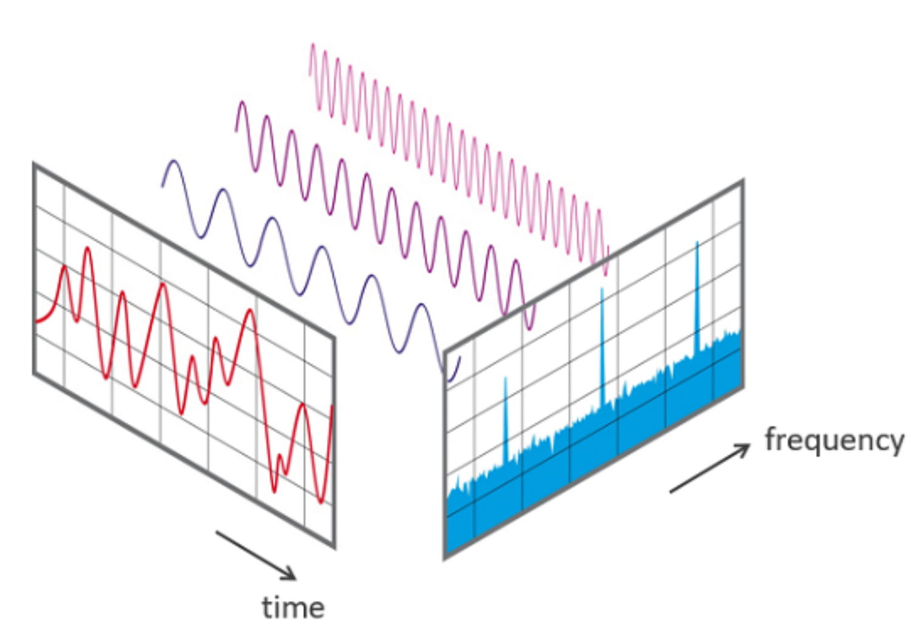</img>

## Fourier Transform
Fourier transform changes a view for signals. We are familier with seeing x-axis as continuous time. The normal graph changes by fourier transform to have x-axis as frequency. These concept is applied to not only continuous time domain, but also to discrete time domain and just discrete slots. These are named to `CTFT (Continuous-Time Fourier Transform)`, `DTFT (Discrete-Time Fourier Transform)`, `DFT (Discrete Fourier Transform)`. More details about systems equation analysis are in Signal ans System lectures. 
  

## CTFT and DTFT
In signals and system, you've learned about correlation as follows:  

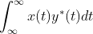</img>

Basis signal of continuous time signal with fundamental frequency f0 is as follows:

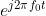</img>

As fourier transform is represented to correlation between x(t) and basis signal, transformed X(f) and verse x(t) are as follows:

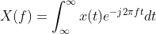</img>

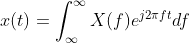</img>

These are quite easily able to understand when you apply the x(t) to frequency domain. It would be explained that "If you want to get a signal at very right t0 time, you need to sum all the frequencies over f-domain and coefficient of them individually". This interperetation is applied to X(f) in exactly same way.  
Then what is DTFT? See a figure below.  
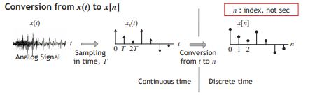  
Sampling is multiplication with signals and impulse train with sampling period T. And multiplication on time domain is transformed to convolution on frequency domain. This concepts are explained following figure.  
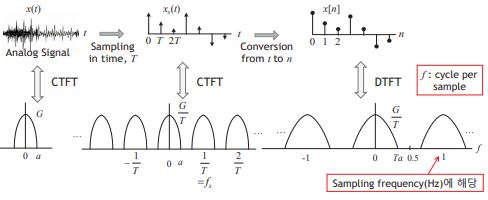  
There are helpful notes to make you understand more clearly in the `pdf folder`.

## DFT Notes (N-Point)

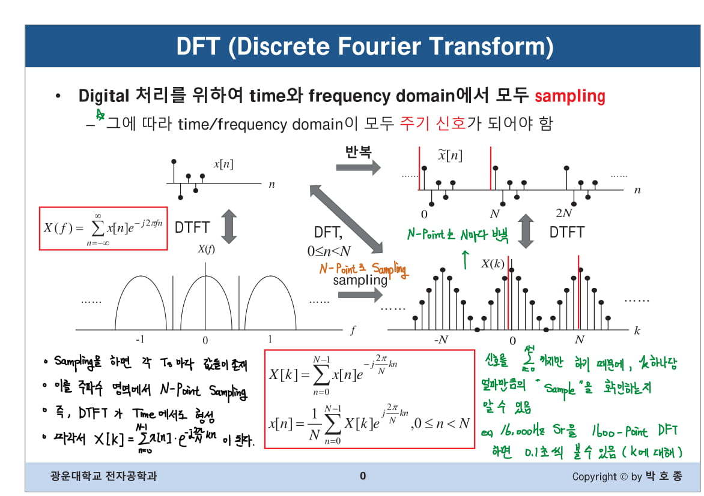</img>

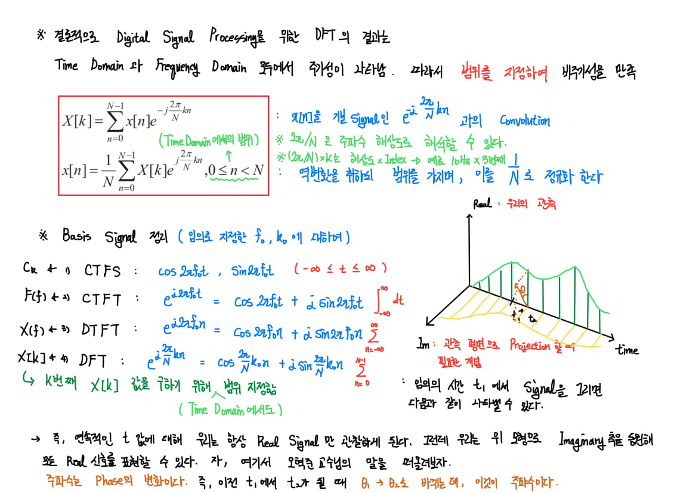</img>

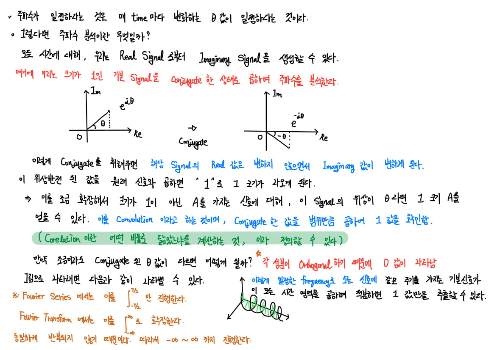</img>

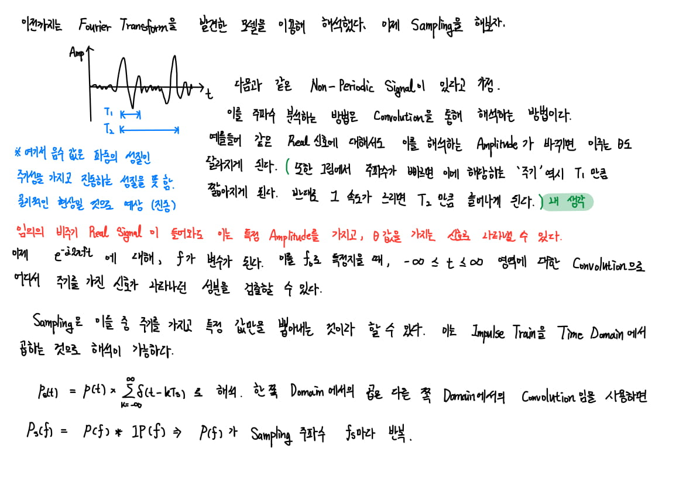</img>

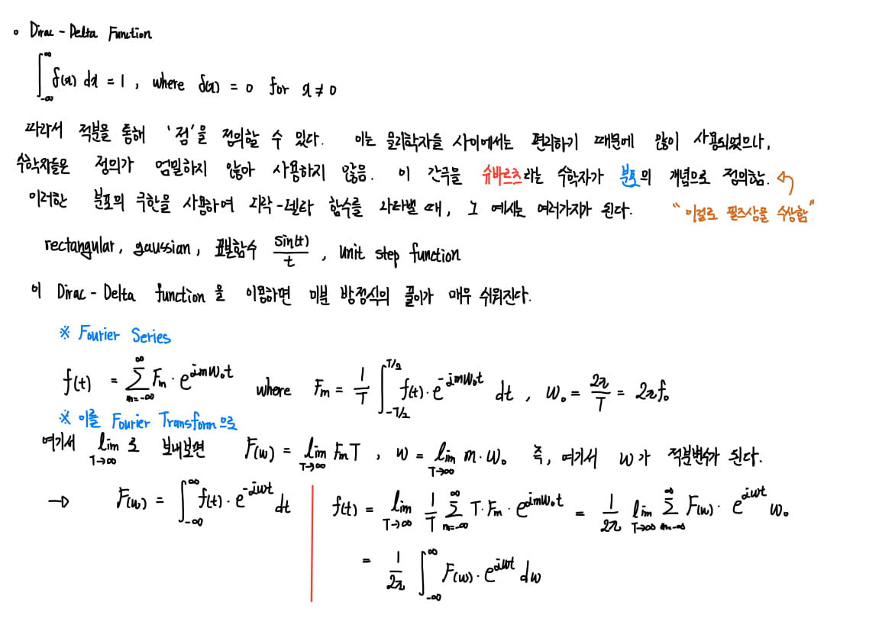</img>

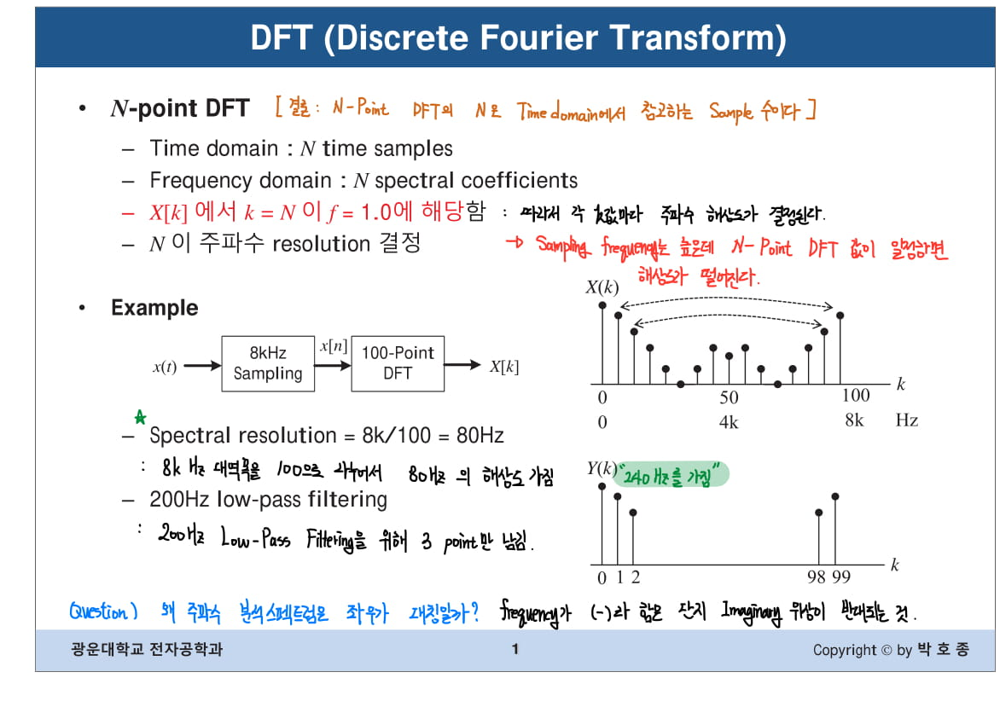</img>

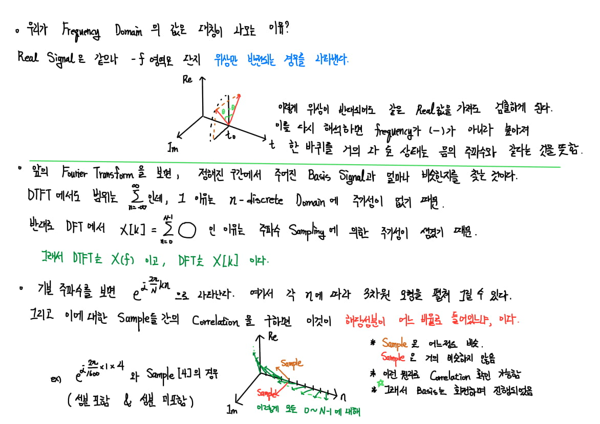</img>

## Reference
- https://web.stanford.edu/class/ee179/lectures/notes11.pdf
- https://lmb.informatik.uni-freiburg.de/lectures/old_lmb/bildverarbeitung/Exercise07/GibbsPhenomena.pdf